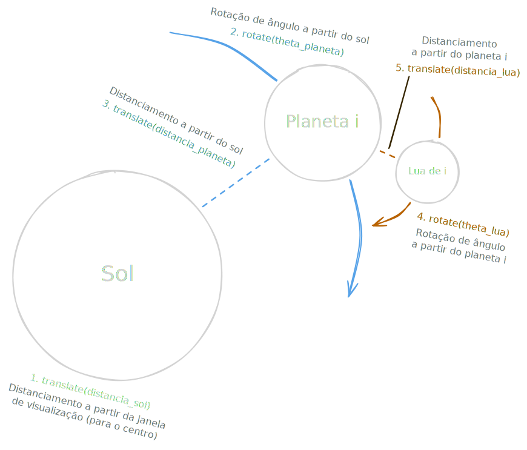

# Sistema Solar com Planetas e Luas

Disciplina: Computação Gráfica (01/2026)  
Professor: PAULO RICARDO MUNIZ BARROS  
Integrantes: ARTHUR DE MELLO, YURI ELLWANGER

## Etapa 1 – Leitura guiada e diagrama

## Etapa 2 – Explanação do fluxo de atualização

- Planeta e Lua são duas classes distintas, mas possuem lógicas de atualização praticamente idênticas, nas quais as variáveis ``theta`` e ``velocidade_orbita`` de cada servem o mesmo papel. A principal diferença é que os planetas também devem invocar os métodos de atualização de suas luas. 
- ``theta`` armazena o valor que é usado como ângulo (em radianos) pelo método ``rotate()`` e representa a órbita do corpo. Ela é incrementada a cada atualização por ``velocidade_orbita`` antes da translação. 
- ``velocidade_orbita`` armazena o valor que representa o movimento da órbita do corpo. Logo, quanto maior o valor da variável, maior será a variação do ângulo de ``theta`` entre cada chamada da função ``update()``, dando a impressão de uma órbita mais rápida ou mais lenta. 
- Na simulação atual do sistema solar, todas as órbitas giram em sentido horário, logo, o valor de ``theta`` é sempre incrementado. Porém, a função ``rotate()`` também interpreta ângulos na forma de radianos negativos, permitindo velocidades negativas ou órbitas em sentido anti-horário. 

## Etapa 4 – Relatório

1. ...
2. ...
3. ...
